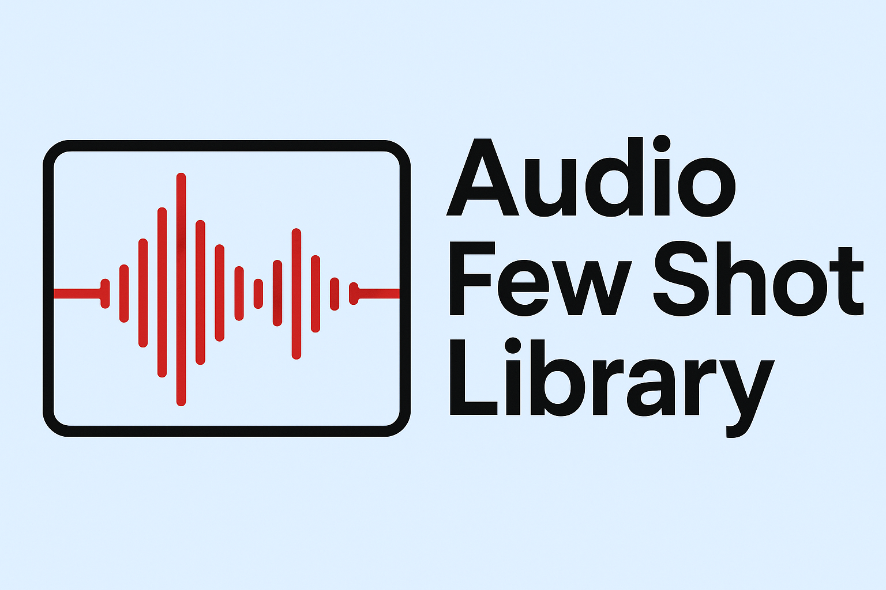

# [LibFewShot](https://arxiv.org/abs/2109.04898)
Make few-shot learning easy.

## Supported Methods
### Non-episodic methods (a.k.a Fine-tuning based methods)
+ [Baseline (ICLR 2019)](https://arxiv.org/abs/1904.04232)
+ [Baseline++ (ICLR 2019)](https://arxiv.org/abs/1904.04232)
+ [RFS (ECCV 2020)](https://arxiv.org/abs/2003.11539)
+ [SKD (BMVC 2021)](https://arxiv.org/abs/2006.09785)
+ [Negcos (ECCV 2020)](https://arxiv.org/abs/2003.12060)
+ [S2M2 (WACV 2020)](https://arxiv.org/abs/1907.12087)
+ [Meta-Baseline (ICCV 2021)](https://arxiv.org/abs/2003.04390)
+ [Diffkendall(NeurIPS 2023)](https://arxiv.org/abs/2307.15317)
### Meta-learning based methods
+ [MatchingNet (NeurIPS 2016)](https://arxiv.org/abs/1606.04080)
+ [MAML (ICML 2017)](https://arxiv.org/abs/1703.03400)
+ [Versa (NeurIPS 2018)](https://openreview.net/forum?id=HkxStoC5F7)
+ [R2D2 (ICLR 2019)](https://arxiv.org/abs/1805.08136)
+ [LEO (ICLR 2019)](https://arxiv.org/abs/1807.05960)
+ [MTL (CVPR 2019)](https://arxiv.org/abs/1812.02391)
+ [ANIL (ICLR 2020)](https://arxiv.org/abs/1909.09157)
+ [IFSL(NeurIPS 2020)](https://arxiv.org/abs/2009.13000)
+ [BOIL (ICLR 2021)](https://arxiv.org/abs/2008.08882)
+ [MeTAL (ICCV 2021)](https://arxiv.org/abs/2110.03909)
### Metric-learning based methods
+ [ProtoNet (NeurIPS 2017)](https://arxiv.org/abs/1703.05175)
+ [RelationNet (CVPR 2018)](https://arxiv.org/abs/1711.06025)
+ [ConvaMNet (AAAI 2019)](https://ojs.aaai.org//index.php/AAAI/article/view/4885)
+ [DN4 (CVPR 2019)](https://arxiv.org/abs/1903.12290)
+ [CAN (NeurIPS 2019)](https://arxiv.org/abs/1910.07677)
+ [ATL-Net (IJCAI 2020)](https://www.ijcai.org/proceedings/2020/0100.pdf)
+ [ADM (IJCAI 2020)](https://arxiv.org/abs/2002.00153)
+ [DSN (CVPR 2020)](https://openaccess.thecvf.com/content_CVPR_2020/papers/Simon_Adaptive_Subspaces_for_Few-Shot_Learning_CVPR_2020_paper.pdf)
+ [FEAT (CVPR 2020)](http://arxiv.org/abs/1812.03664)
+ [RENet (ICCV 2021)](https://arxiv.org/abs/2108.09666)
+ [FRN (CVPR 2021)](https://arxiv.org/abs/2012.01506)
+ [DeepBDC (CVPR 2022)](https://arxiv.org/abs/2204.04567)
+ [MCL (CVPR 2022)](http://openaccess.thecvf.com/content/CVPR2022/html/Liu_Learning_To_Affiliate_Mutual_Centralized_Learning_for_Few-Shot_Classification_CVPR_2022_paper.html)
+ [CPEA (ICCV 2023)](https://openaccess.thecvf.com/content/ICCV2023/papers/Hao_Class-Aware_Patch_Embedding_Adaptation_for_Few-Shot_Image_Classification_ICCV_2023_paper.pdf)

## Quick Installation

Please refer to [install.md](https://libfewshot-en.readthedocs.io/en/latest/install.html)([安装](https://libfewshot-en.readthedocs.io/zh_CN/latest/install.html)) for installation.

Complete tutorials can be found at [document](https://libfewshot-en.readthedocs.io/en/latest/)([中文文档](https://libfewshot-en.readthedocs.io/zh_CN/latest/index.html)).

## Reproduction

## License
This project is licensed under the MIT License. See LICENSE for more details.

## Acknowledgement
LibFewShot is an open source project designed to help few-shot learning researchers quickly understand the classic methods and code structures. We welcome other contributors to use this framework to implement their own or other impressive methods and add them to LibFewShot. This library can only be used for academic research. We welcome any feedback during using LibFewShot and will try our best to continually improve the library.

## Citation
If you use this code for your research, please cite our paper.

