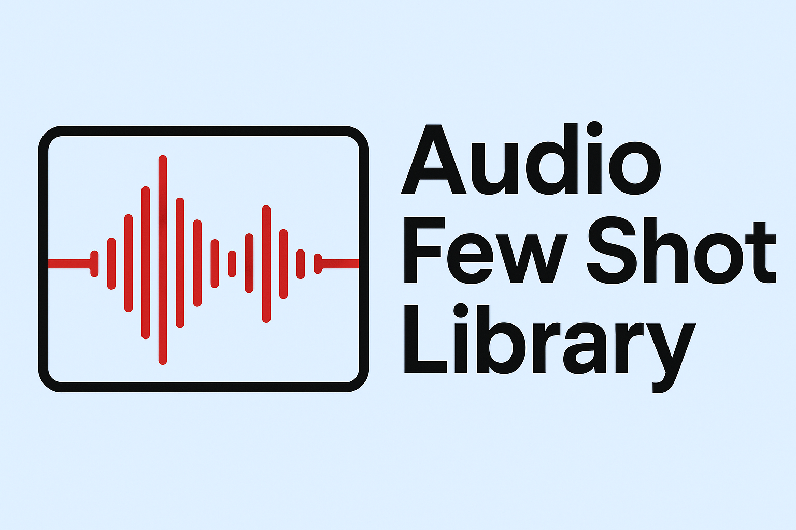
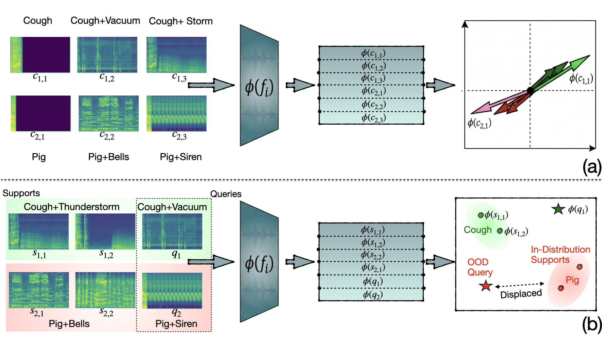

# SpurAudio: An Audio Few-Shot Classification Library

Official implementation for:

**SpurAudio: A Benchmark for Studying Shortcut Learning in Few-Shot Audio Classification**

Authors: Anonymous

<p align="center">
	<a href="https://libfewshot-en.readthedocs.io/en/latest/">
		
	</a>
</p>

---

## Overview

This repository extends LibFewShot for few-shot **audio** classification experiments on SpurAudio, with support for:

- IID and OOD episode evaluation.
- Multiple few-shot paradigms (fine-tuning, meta-learning, metric-learning).
- Backbone and classifier modular configuration through YAML.

- <p align="center">
	
</p>

---

## Supported Methods

### Non-episodic (fine-tuning based)
- [Baseline (ICLR 2019)](https://arxiv.org/abs/1904.04232)
- [Baseline++ (ICLR 2019)](https://arxiv.org/abs/1904.04232)
- [Meta-Baseline (ICCV 2021)](https://arxiv.org/abs/2003.04390)
- [DiffKendall (NeurIPS 2023)](https://arxiv.org/abs/2307.15317)

### Meta-learning based
- [MAML (ICML 2017)](https://arxiv.org/abs/1703.03400)
- [Versa (NeurIPS 2018)](https://openreview.net/forum?id=HkxStoC5F7)
- [R2D2 (ICLR 2019)](https://arxiv.org/abs/1805.08136)
- [LEO (ICLR 2019)](https://arxiv.org/abs/1807.05960)
- [MTL (CVPR 2019)](https://arxiv.org/abs/1812.02391)
- [ANIL (ICLR 2020)](https://arxiv.org/abs/1909.09157)
- [BOIL (ICLR 2021)](https://arxiv.org/abs/2008.08882)
- [MeTAL (ICCV 2021)](https://arxiv.org/abs/2110.03909)

### Metric-learning based
- [ProtoNet (NeurIPS 2017)](https://arxiv.org/abs/1703.05175)
- [RelationNet (CVPR 2018)](https://arxiv.org/abs/1711.06025)
- [DN4 (CVPR 2019)](https://arxiv.org/abs/1903.12290)
- [ATL-Net (IJCAI 2020)](https://www.ijcai.org/proceedings/2020/0100.pdf)
- [ADM (IJCAI 2020)](https://arxiv.org/abs/2002.00153)
- [FRN (CVPR 2021)](https://arxiv.org/abs/2012.01506)
- [DeepBDC (CVPR 2022)](https://arxiv.org/abs/2204.04567)
- [MCL (CVPR 2022)](http://openaccess.thecvf.com/content/CVPR2022/html/Liu_Learning_To_Affiliate_Mutual_Centralized_Learning_for_Few-Shot_Classification_CVPR_2022_paper.html)

---

## Reproducibility Guide

### 1) Environment setup

```bash
cd /path/to/LibFewShot
python3 -m venv .venv
source .venv/bin/activate
pip install --upgrade pip
pip install -r requirements.txt
```

### 2) Dataset and metadata preparation

Make sure these assets exist and match your local paths:

- `SpurAudio_dataset/` (or your configured data root).
- `Auxiliary/Spurious_Mean_Std.npy` (or selected mean/std file).
- `Auxiliary/KOS_paper_splits.npy` (class split definition).

If your machine paths differ, update the relevant YAML entries such as `data_root`, `mean_std_file`, and `class_per_split`.

### 3) Choose or create a YAML config

Configs are under `config/` (examples: `config/proto_5shot_iid.yaml`, `config/maml_5shot_ood.yaml`).

Run training with:

```bash
python run_trainer.py --yaml_path ./config/proto_5shot_iid.yaml # or any other yaml file
```

### 4) IID vs OOD evaluation toggle (important)

For IID/OOD experiments, set the YAML key **`ood`** explicitly:

- `ood: False`  → IID evaluation
- `ood: True`   → OOD evaluation

Example:

```yaml
ood: False  # IID
# ood: True # OOD
```

> Note: the key in this codebase is lowercase `ood`.

### 5) Test a trained experiment

`run_test.py` currently loads a result directory via the `PATH` variable inside the script.

1. Open `run_test.py`.
2. Set `PATH` to your trained run directory under `results/`.
3. Run:

```bash
python run_test.py --yaml_path ./config/proto_5shot_iid.yaml # or any other yaml file
```
---

## Quick Run Examples

### ProtoNet 5-shot IID

```bash
python run_trainer.py --yaml_path ./config/proto_5shot_iid.yaml
```

### ProtoNet 5-shot OOD

```bash
python run_trainer.py --yaml_path ./config/proto_5shot_ood.yaml
```

---

## License

This project is licensed under the MIT License. See `LICENSE` for details.

## Acknowledgement

LibFewShot is an open-source framework for few-shot learning research. Contributions, feedback, and extensions are welcome.

## Citation

If you use this repository in your research, please cite the corresponding SpurAudio/LibFewShot paper(s).


